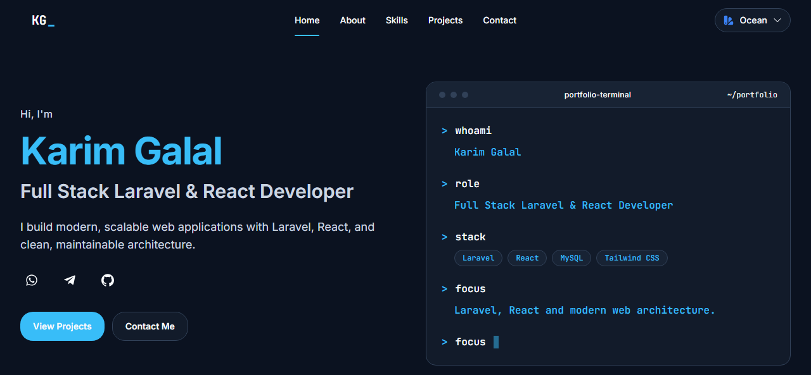
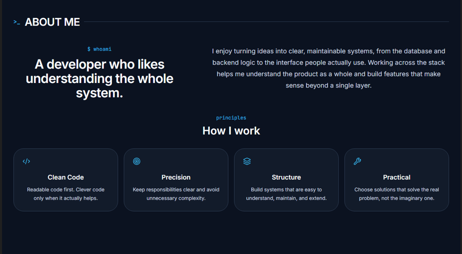
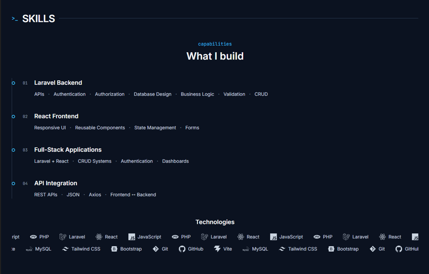
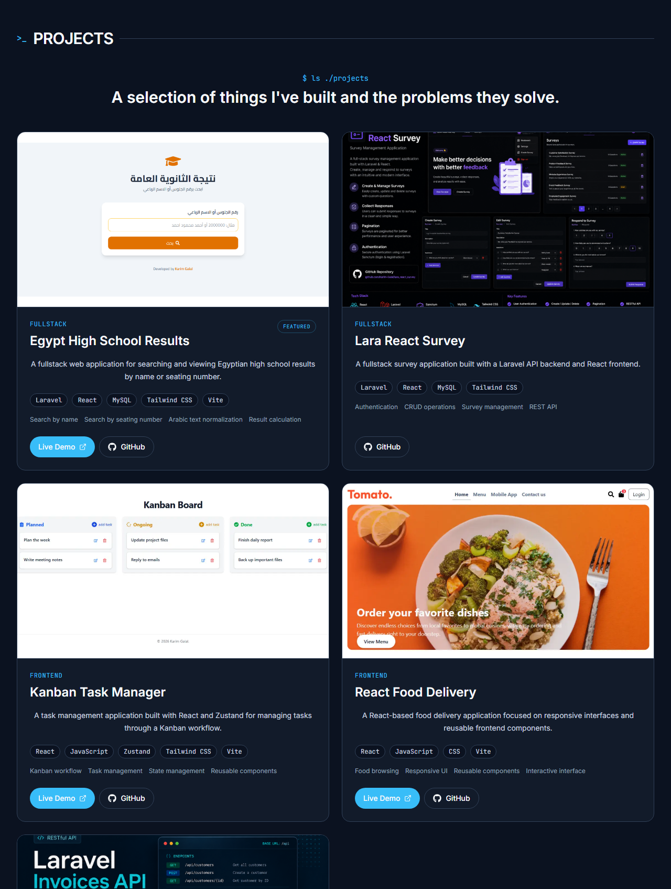
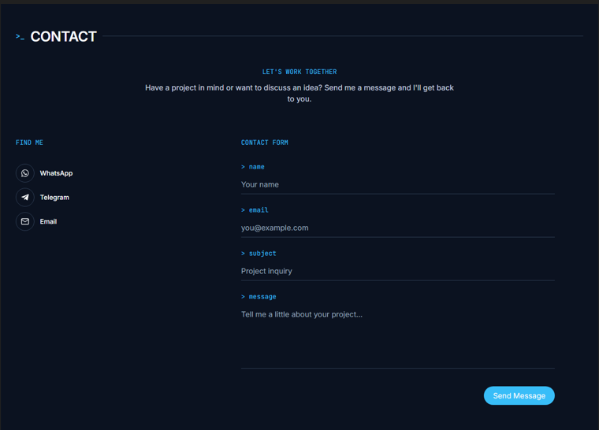

# Karim Galal — Portfolio


My personal portfolio showcasing my projects, technical skills, and experience as a **Full-Stack Laravel & React Developer**.

Built with React, Vite, Tailwind CSS, and a modular frontend architecture designed to grow with the portfolio.



---

## Live Demo

[](https://karim-galal.vercel.app/)

https://karim-galal.vercel.app/

---

## Features

* Responsive portfolio design
* Hero introduction and developer profile
* About section
* Technical skills showcase
* Project showcase
* Project technology information
* Contact section
* Social and professional links
* Responsive navigation
* Modern UI built with Tailwind CSS
* Smooth animations and interactions
* SEO-friendly metadata
* Modular and scalable frontend architecture
* Theme-ready design

---

## Tech Stack

* React
* Vite
* Tailwind CSS v4
* React Router
* JavaScript
* Motion
* Lucide React
* React Icons
* Axios

---

## Architecture

The project follows a modular React architecture separating application configuration, pages, sections, reusable components, and portfolio data.

```text
src/
├── app/
│   ├── config/
│   └── router/
│
├── pages/
│
├── sections/
│   ├── hero/
│   ├── about/
│   ├── skills/
│   ├── projects/
│   └── contact/
│
├── shared/
│   ├── components/
│   └── hooks/
│
├── data/
├── layouts/
├── styles/
├── assets/
│
├── App.jsx
└── main.jsx
```

---

## Screenshots

### About



### Skills



### Projects



### Contact



---

## Future Plans

The current version focuses on the frontend portfolio experience, with additional capabilities planned for future iterations.

* Arabic / English localization
* Backend integration
* Functional contact system
* Additional interactive features
* More portfolio projects and case studies
* Continuous UI and performance improvements

---

## Project Purpose

This portfolio was built to provide a professional presentation of my development work and to showcase my experience building modern web applications with Laravel and React.

It also serves as a central place to explore my projects, technical skills, and ongoing development work.

---

## Author

**Karim Galal**

Full-Stack Laravel & React Developer

[GitHub](https://github.com/Karim-Galal)
